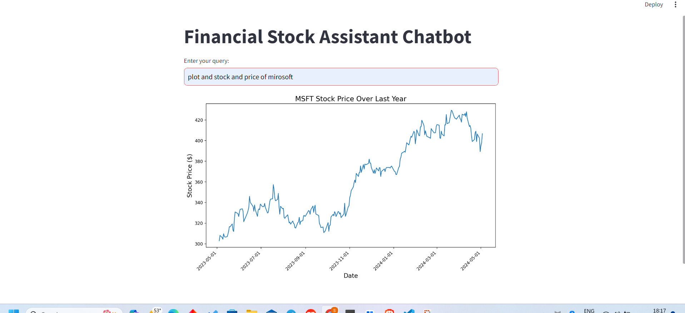

# Financial Stock Assistant Chatbot

The Financial Stock Assistant Chatbot is a tool designed to assist users in making informed decisions while trading or investing in stocks. It leverages artificial intelligence (AI) to provide various functionalities, including fetching stock prices, calculating technical indicators such as Simple Moving Average (SMA), Exponential Moving Average (EMA), Relative Strength Index (RSI), Moving Average Convergence Divergence (MACD), and plotting stock price graphs.

The Financial Stock Assistant Chatbot is a tool designed to assist users in making informed decisions while trading or investing in stocks...

## Features

### 1. Stock Price Query
- Fetches real-time stock prices for a given ticker symbol.

### 2. Simple Moving Average (SMA)
- Calculates the Simple Moving Average (SMA) for a specified window size.

### 3. Exponential Moving Average (EMA)
- Calculates the Exponential Moving Average (EMA) for a specified window size.

### 4. Relative Strength Index (RSI)
- Computes the Relative Strength Index (RSI) for a given stock.

### 5. Moving Average Convergence Divergence (MACD)
- Calculates the Moving Average Convergence Divergence (MACD) for a given stock.

### 6. Plotting Stock Price Graphs
- Generates and displays a graphical representation of the stock price over a specified period.

## Usage

1. **Enter Query**: Input your query in the text box provided.
2. **Receive Response**: The chatbot will process your query using AI and provide the relevant information or analysis.
3. **View Results**: Results will be displayed in the chat window, including text-based responses or graphical plots.

## How to Run

To run the Financial Stock Assistant Chatbot, follow these steps:

1. Install the required dependencies by running `pip install -r requirements.txt`.
2. Run the Streamlit app using the command `streamlit run app.py`.
3. Access the chatbot interface in your web browser.

## Technologies Used

- Python
- Streamlit
- OpenAI
- yfinance
- Matplotlib
- Pandas
- NumPy

## Contributions

Contributions to the Financial Stock Assistant Chatbot are welcome! If you have ideas for new features, improvements, or bug fixes, please submit an issue or pull request.

## License

This project is licensed under the [MIT License](LICENSE).
